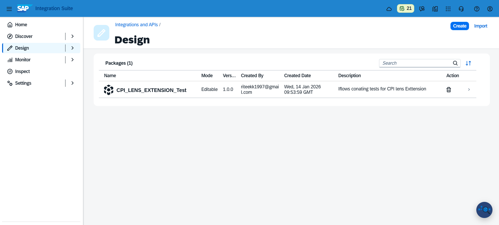
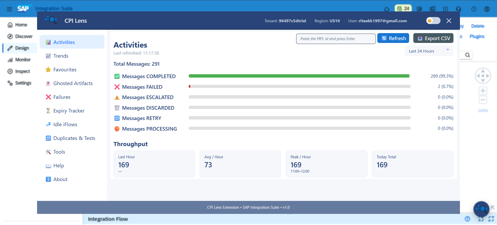
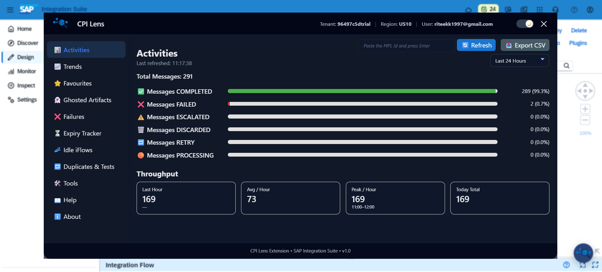
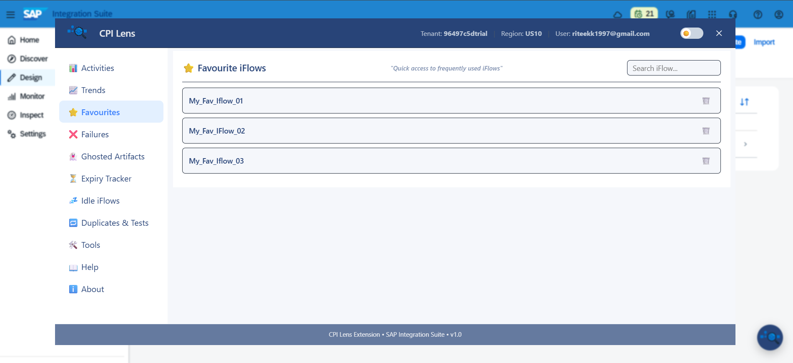
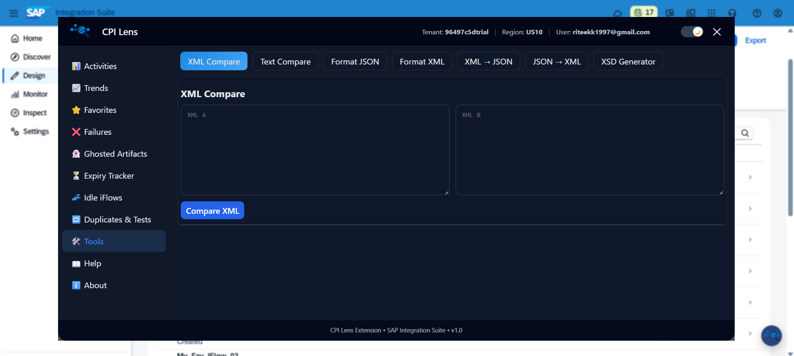

# CPI_Lens_Extension 

-Smart Observability and analytics for SAP CPI (Integration Suite) iFlows. 

CPI Lens is an open-source browser extension designed to enhance productivity, visibility, and operational efficiency for SAP CPI (Integration Suite) developers and support teams.

Working with SAP CPI often involves repetitive navigation, limited runtime insights, and frequent context switching between tools. CPI Lens addresses these challenges by bringing *intuitive analytics, runtime insights, and developer utilities directly into the CPI UI*.

# Data & Privacy

CPI Lens is designed with privacy and security as first-class principles.
 
 - CPI Lens does not collect, store, or transmit any user credentials.
 - All data processing happens locally within the browser.
 - No SAP CPI data is sent to external servers or third-party services.
 - The extension does not track user activity and does not use analytics, telemetry, or advertising scripts.
 - CPI Lens does not modify, persist, or write back any data to SAP systems.
 - No personal data is collected, shared, or sold.
- No cookies or persistent identifiers are used outside of optional local browser storage for user preferences.
CPI Lens operates strictly as a read-only enhancement layer to improve visibility and usability within the SAP CPI user interface.

## 🚀 Why CPI Lens?

SAP CPI is powerful, but daily development and support tasks can be time-consuming:
- Finding "ghosted" or idle iFlows
- Tracking message processing trends
- Managing duplicates and test artifacts
- Switching between external tools for formatting and schema work

CPI Lens reduces this friction by surfacing *critical information instantly*, helping teams focus on what truly matters.

---

# ✨ Key Features

### 📊 Intuitive Analytics
- High-level insights into tenant usage and activity
- Helps understand system behavior quickly

### ❌ Failures
- Quickly identify failed iFlows
- Faster analysis during incident handling

### ⭐ Favourites
- Bookmark important iFlows
- One-click access to business-critical integrations

### 👻Ghosted Artifacts
- Identify iFlows that exist only in runtime but have no corresponding design-time artifact available for updates.

### 💤 Idle iFlows
- Detect unused or inactive integrations
- Improve tenant cleanliness and governance

### 🧪 Duplicates & Test iFlows
- Identify duplicate or test artifacts easily
- Avoid confusion and reduce risk in productive tenants

### 📈 Trends (MPL)
- Message Processing Log (MPL) trends
- Spot anomalies, spikes, or recurring patterns early

### 🧰 Built-in Tools
- XML / JSON formatters
- Payload converters
- XSD generator
- No need to leave the CPI UI
  
# Installation 

### Install directly from the Chrome Web Store or Microsoft Edge Add-on 
   Chrome Web Store: https://chromewebstore.google.com/detail/cpi-lens-sap-integration/hojcibdjgfibcpfkcgcepblnmmepinhh 
   Edge Add-On: https://microsoftedge.microsoft.com/addons/detail/cpi-lens-sap-integration/jccgihhnjabampjlacooeejjmcbbkgjf

   - Updates will be installed automatically.
   
# Usage 
  Open your browser (Chrome/Edge)
  Log in to the SAP Integration Suite tenant.
  Once logged in, the CPI Lens icon will appear in the bottom-right corner, as shown in the image below.
  
  

  Click to open the Overlay, where you will be able to access all features. 
  CPI Lens is available in Light and Dark Mode.
  
  Light Mode:
  
  

  Dark Mode :
  
  

  Favourites :
  
  
  Trends:
  
  

  Tools:

  

# Changelog
### v1.0.0 – First Public Release

🧭 Quick tenant identification with clear visual indicators

📊 Message processing analytics (Success, Failed, Processing, Escalated)

📈 Message volume trends for fast runtime insights

⭐ Favorite iFlows for quick access

👻 Ghosted artifacts detection

💤 Idle iflows detection

⏱️ Cert/keys expiry tracking

🛠️ Built-in utilities (formatters, converters, schema tools)

